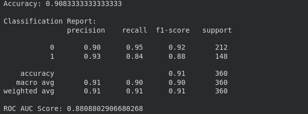

# Link to the Streamlit application
https://emergency-preparedness.streamlit.app/

# Machine Learning
  **Models Tested**:
- Logistic Regression
- RandomForestClassifier

# Metrics of Logistic Regression
```
from sklearn.linear_model import LogisticRegression
from sklearn.metrics import accuracy_score,classification_report,confusion_matrix

model = LogisticRegression()
model.fit(X_train, y_train)

print("Accuracy:", accuracy_score(y_test, y_pred))
print("\nClassification Report:\n", classification_report(y_test, y_pred))
```


```
# Confusion Matrix
cm = confusion_matrix(y_test, y_pred)
sns.heatmap(cm, annot=True, fmt="d", cmap="Blues")
plt.xlabel("Predicted")
plt.ylabel("Actual")
plt.title("Confusion Matrix")
plt.show()
```


# Metrics of RandomForestClassifier
```
from sklearn.ensemble import RandomForestClassifier

rf = RandomForestClassifier(
    n_estimators=1100,
    max_depth=8,
    min_samples_split=10,
    random_state=42
)
rf.fit(X_train, y_train)
y_pred_rf = rf.predict(X_test)


print("Accuracy:", accuracy_score(y_test, y_pred_rf))
print(classification_report(y_test, y_pred_rf))
```


# EDAs

